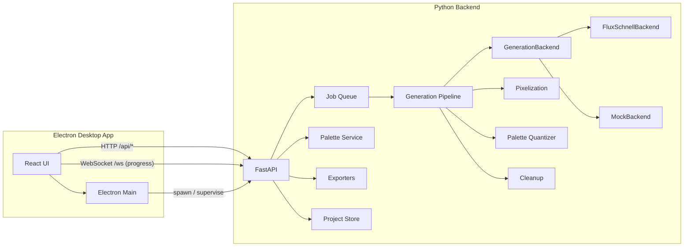
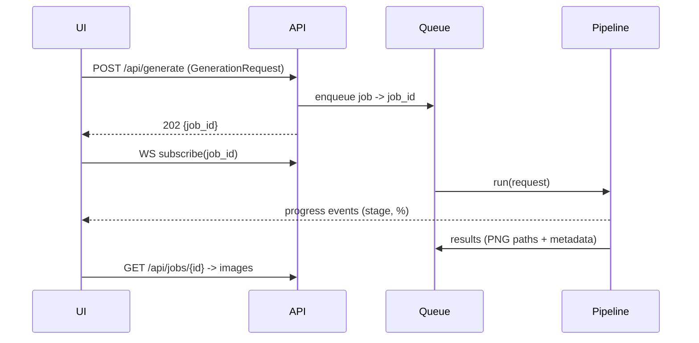

# PixelForge AI — Architecture

## System Overview

PixelForge is a local-first desktop application composed of two processes:

1. **Backend** (`backend/`, Python 3.10+, FastAPI): generation pipeline, job queue, palettes,
   exporters, project persistence. Runs on `127.0.0.1:8765`, spawned and supervised by the desktop app.
2. **Frontend** (`frontend/`, Electron + React + TypeScript): UI shell, generation controls,
   integrated pixel editor, project browser. Talks to the backend over HTTP + WebSocket.



## Generation Data Flow



## Backend Subsystems (`backend/src/pixelforge/`)

| Module | Responsibility |
|---|---|
| `config/` | Centralized settings (`Settings`, pydantic-settings): paths, device, model, server. Single source of truth; overridable via env vars (`PIXELFORGE_*`) and `configs/default.toml`. |
| `api/` | FastAPI routers: `generation`, `jobs`, `palettes`, `styles`, `modes`, `export`, `projects`, `system`. Thin layer — no business logic. |
| `core/` | Domain models (`GenerationRequest`, `GenerationResult`, `Job`, `SceneGraph`), the async `JobQueue` (asyncio, cancellation, progress callbacks), errors, logging setup. |
| `agents/` | Agentic planning layer (D-009/D-010): seven `SceneGraph`-building agents (`intent`, `art-director`, `composition`, `silhouette`, `lighting`, `material`, `animation`) run in dependency order by `PlanningRuntime` over a swappable `PlanningBackend` (`planning_backends/`, deterministic `mock`). The silhouette plan compiles into a Stage-A control map; each planned asset gets a `*.provenance.json` sidecar. Off by default; opt-in via `planning_enabled`. |
| `generation/` | `GenerationPipeline` orchestrating stages; `backends/` implementing `GenerationBackend` (`flux.py` — fp8/offload/ControlNet on the silhouette map, decisions in torch-free `flux_config.py`; `mock.py`); `prompt_builder.py` (fast path) and `plan_compiler.py` (compiles a `SceneGraph` into prompts when planning is on); `tileize.py` (M22 — pure wrap-aware seam-blend `make_tileable` + `seam_metrics`/`seam_score`, applied before quantization when `request.tileable`); `benchmark.py` (M2: times + QA-scores a fixed suite, `pixelforge benchmark`). Golden-image regression in `tests/golden/`. |
| `pixelize/` | Stage B: content-aware downsampling / grid snapping (`grid_snap.py`), alpha handling. Pure image processing, model-independent. |
| `qa/` | Pixel QA engine (D-013): **Layer 1** (M9) deterministic detectors (`detectors/`: floating pixels, broken clusters, palette overflow, silhouette, pillow shading, light direction) with safe auto-repair, a deterministic `HeuristicCritic` (reuses D-012), and `QAEngine` (run/repair). **Layer 2** (M15) the QA-gated `RepairLoop` (`repair_loop.py`): critique → regenerate only the failing regions via a swappable `RegionRegenerator` (deterministic inpaint + real-backend img2img), bounded and monotonic. **Semantic critic** (M17): `VLMCritic` over swappable `critic_backends/` (deterministic mock + gated real VLM) adds subject-match/appeal to the score and feeds the repair loop. Findings drop into `SceneGraph.qa`. **Seam-discontinuity detector** (M22): flags a visible tiling seam (edge-wrap difference) for sprites meant to tile (`DetectorContext.tileable`). Opt-in via `qa_enabled` / `qa_repair_loop` / `qa_critic`. |
| `memory/` | Character memory (D-011, M10): `Character` (identity fragment, locked palette, reference frames, identity embedding), `CharacterStore` (JSON + frame PNGs), swappable `EmbeddingBackend` (deterministic mock), `CharacterMemory` (apply identity to a request; cosine-similarity drift gate). Opt-in per request via `character_id`. |
| `palettes/` | `Palette` model, extraction (median-cut/octree), quantization + dithering, swapping, import/export (JASC-PAL, GPL, hex JSON), retro-console-inspired presets. **Palette intelligence** (D-012, M8): `color_math.py` (sRGB/Lab, WCAG contrast, CIEDE2000, Machado CVD) + `analysis.py` (ranking, ramps, dedup, CVD confusion, perceptual compression, readability, suggestions) — pure, deterministic, no models. |
| `styles/` | `StylePreset` registry (NES/SNES/GB/GBA-inspired, modern indie, JRPG, isometric, ...). Data-driven: each preset = prompt fragments + pipeline parameter overrides. Extensible via user TOML files. |
| `modes/` | `GenerationMode` registry (15 modes). Each mode = prompt template + default size/style/postprocessing. Extensible like styles. |
| `animation/` | Animation (M3/M18/M19, D-009): action definitions (13, `actions.py`), `AnimationSequence` (`sequence.py`) — seed-anchored + palette-locked frame generation, optional per-frame QA, **reference chaining** (each frame img2img's from the previous) and **per-frame identity-consistency** (reuses the D-011 embedding gate), plus GIF + sprite-sheet assembly (`assembly.py`). `POST /api/animation/generate`, `pixelforge animate`. |
| `exporters/` | PNG, GIF, sprite sheet, texture atlas (JSON), Unity (`.meta`-ready layout), Godot (`.tres`/import hints), Unreal (padded POT sheets), **Aseprite** (`.aseprite`, M20 — indexed binary writer + parser, uncompressed cels for byte-stability), **Wang/blob** (`wang-blob`, M22 — builds the 47-tile blob auto-tile sheet from one base tile by edge/corner carving; emits sheet + JSON bitmask→cell map). Registry pattern — new exporters register themselves. |
| `dataset/` | Dataset & LoRA-training toolkit (D-001, M21): `build_dataset` is a pure, deterministic pipeline — **validate** (corrupt/undersize/oversize/non-square), **dedup** (`phash.py` NEAREST-resize difference-hash + greedy Hamming clustering), **caption** (`caption.py`, reuses D-012 palette intelligence — no model) — emitting a kohya/HF `manifest.jsonl` + `lora_config.json` (near-duplicates excluded). `LoraTrainer` (`trainer.py`) is gated exactly like FLUX (`is_available()`/`train()` raises `BackendUnavailableError`; pure `training_plan()`). `pixelforge dataset build <dir>`, `POST /api/dataset`. |
| `projects/` | Project files (JSON on disk), autosave, session recovery. |
| `models_manager/` | Model discovery, download, cache dirs, device selection (CUDA → MPS → CPU). |
| `plugins/` | Plugin SDK (D-014, M12): `loader.py` discovers `pixelforge.*` entry points across installed distributions, validates each against a required `PluginManifest` (`manifest.py`, semver plugin API), and registers components into the existing registries (agents, exporters, QA detectors, generation/planning/embedding backends). Disabled by default; loads only allowlisted distributions with per-component failure isolation. Surfaced at `GET /api/plugins` and `pixelforge list plugins`. |

### Key Interfaces

```python
class GenerationBackend(ABC):
    name: str
    def is_available(self) -> bool: ...
    def generate(self, spec: DiffusionSpec, on_progress: ProgressFn) -> list[Image]: ...

class Exporter(ABC):
    format_id: str
    def export(self, asset: ExportAsset, options: ExportOptions, dest: Path) -> list[Path]: ...
```

Pipeline stages are functions `(Image, StageParams) -> Image`, composed by `GenerationPipeline`.
Everything downstream of Stage A is deterministic and unit-testable without model weights.

## Frontend (`frontend/src/`)

| Path | Responsibility |
|---|---|
| `main/` | Electron main process: window management, backend process supervision, native menus, multi-window. |
| `renderer/app/` | App shell, routing, dark theme (CSS variables), dockable panel layout. |
| `renderer/features/generation/` | Prompt/controls panel, mode & style pickers, queue view, results grid; inline Scene Graph **plan preview** (M13); **generate-as-character** selector (M14); **seamless-tiling** toggle + live 3×3 tiling preview with a seamlessness readout (M22, pure `tileView.ts` tested); `recentResults.ts` helper shared with QA/Characters. |
| `renderer/features/editor/` | Canvas-based pixel editor: tools (pencil/eraser/fill/line/rect/ellipse/select/move), layers, onion skinning, timeline, grid/zoom, tile preview. |
| `renderer/features/plan/` | Plan preview (M13, D-009/D-010): `POST /api/plan` → Scene Graph summary, silhouette grid, compiled prompt, agent trace. Pure `planView.ts` (tested). |
| `renderer/features/animation/` | Animation tab (M18, D-009): action picker, animated stage with play/pause + onion-skin, clickable timeline, locked palette, GIF/sheet export. Pure `playback.ts` (tested). |
| `renderer/features/qa/` | Pixel QA panel (M13, D-013): run detectors on a result/uploaded sprite, score bars + findings, apply safe repairs. Pure `qaView.ts` (tested). |
| `renderer/features/characters/` | Character manager (M13, D-011): list/create, reference frames, cosine drift meter. |
| `renderer/features/palettes/` | Palette browser/editor, extraction, locking UI; **Palette Lab** (M13, D-012): contrast/CVD/ramps/readability analysis. |
| `renderer/features/dataset/` | **Dataset** tab (M21, D-001): multi-file sprite upload → `POST /api/dataset`; summary counts, per-image validation table (trainable/duplicate/invalid badges), duplicate clusters, and manifest.jsonl + lora_config.json previews. Pure `datasetView.ts` (tested). |
| `renderer/features/projects/` | Project browser, autosave indicator. |
| `renderer/api/` | Typed API client + WebSocket progress hook (agentic-layer endpoints added M13); image ↔ base64 helpers; types mirror backend pydantic models. |
| `renderer/state/` | Zustand stores: generation, editor (with undo/redo history), characters (M13), palettes, projects. |

Editor state uses an immutable-snapshot undo/redo stack; pixel data lives in typed arrays
(`Uint8ClampedArray` per layer) rendered to `<canvas>` with nearest-neighbor scaling.

## Configuration

All backend config flows through `pixelforge.config.Settings`; all frontend config through
`frontend/src/shared/config.ts`. `configs/default.toml` documents every option.

## Testing Strategy

- Backend unit tests (pytest): pixelize, palettes, exporters, modes/styles, queue — all run against
  `MockBackend`, no weights needed.
- Backend integration tests: FastAPI TestClient over full generate→export flow.
- Frontend: vitest unit tests for stores/utils; Playwright for UI smoke tests (later milestone).
- CI (GitHub Actions): lint (ruff, eslint), typecheck (mypy, tsc), tests on Linux.

## Extensibility Points

1. **Generation backends** — implement `GenerationBackend`, register in `backends/registry.py`.
2. **Styles / modes** — drop a TOML file in the user styles/modes directory; no code changes.
3. **Exporters** — implement `Exporter`, register in `exporters/registry.py`.
4. **Palettes** — JSON/GPL/PAL files in the user palettes directory.
5. **Plugins (future)** — see ROADMAP milestone M6.
