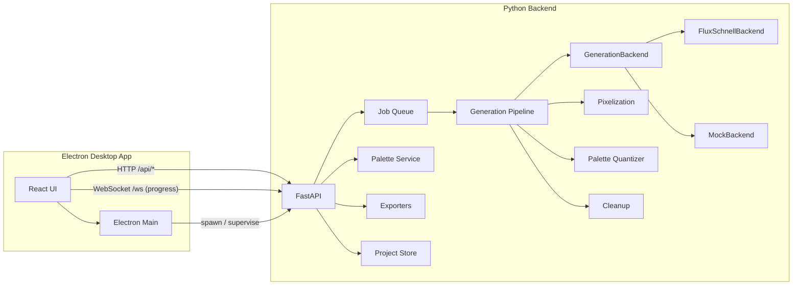
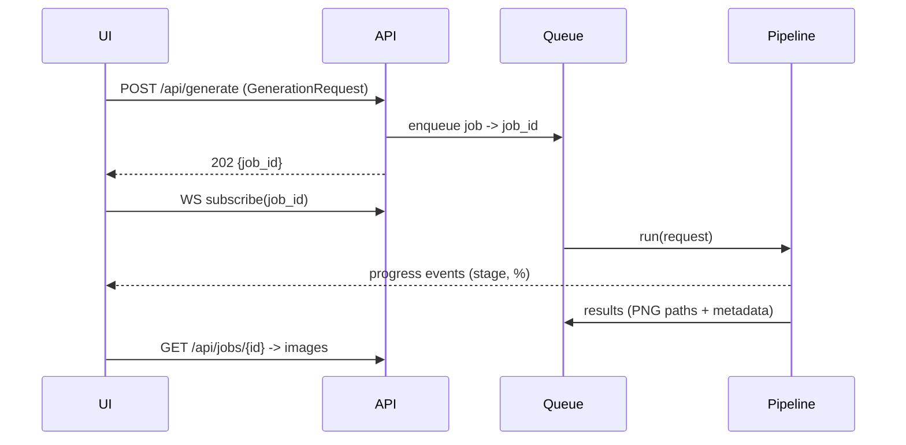

# PixelForge AI — Architecture

## System Overview

PixelForge is a local-first desktop application composed of two processes:

1. **Backend** (`backend/`, Python 3.10+, FastAPI): generation pipeline, job queue, palettes,
   exporters, project persistence. Runs on `127.0.0.1:8765`, spawned and supervised by the desktop app.
2. **Frontend** (`frontend/`, Electron + React + TypeScript): UI shell, generation controls,
   integrated pixel editor, project browser. Talks to the backend over HTTP + WebSocket.



## Generation Data Flow



## Backend Subsystems (`backend/src/pixelforge/`)

| Module | Responsibility |
|---|---|
| `config/` | Centralized settings (`Settings`, pydantic-settings): paths, device, model, server. Single source of truth; overridable via env vars (`PIXELFORGE_*`) and `configs/default.toml`. |
| `api/` | FastAPI routers: `generation`, `jobs`, `palettes`, `styles`, `modes`, `export`, `projects`, `system`. Thin layer — no business logic. |
| `core/` | Domain models (`GenerationRequest`, `GenerationResult`, `Job`, `SceneGraph`), the async `JobQueue` (asyncio, cancellation, progress callbacks), errors, logging setup. |
| `agents/` | Agentic planning layer (D-009/D-010): `SceneGraph`-building agents (`intent`, `art-director`) run by `PlanningRuntime` over a swappable `PlanningBackend` (`planning_backends/`, deterministic `mock`). Off by default; opt-in via `planning_enabled`. |
| `generation/` | `GenerationPipeline` orchestrating stages; `backends/` implementing `GenerationBackend` (`flux.py`, `mock.py`); `prompt_builder.py` (fast path) and `plan_compiler.py` (compiles a `SceneGraph` into prompts when planning is on). |
| `pixelize/` | Stage B: content-aware downsampling / grid snapping (`grid_snap.py`), alpha handling. Pure image processing, model-independent. |
| `palettes/` | `Palette` model, extraction (median-cut/octree), quantization + dithering, swapping, import/export (JASC-PAL, GPL, hex JSON), retro-console-inspired presets. **Palette intelligence** (D-012, M8): `color_math.py` (sRGB/Lab, WCAG contrast, CIEDE2000, Machado CVD) + `analysis.py` (ranking, ramps, dedup, CVD confusion, perceptual compression, readability, suggestions) — pure, deterministic, no models. |
| `styles/` | `StylePreset` registry (NES/SNES/GB/GBA-inspired, modern indie, JRPG, isometric, ...). Data-driven: each preset = prompt fragments + pipeline parameter overrides. Extensible via user TOML files. |
| `modes/` | `GenerationMode` registry (15 modes). Each mode = prompt template + default size/style/postprocessing. Extensible like styles. |
| `animation/` | Animation action definitions (13 actions), frame-sequence generation strategy, GIF assembly. |
| `exporters/` | PNG, GIF, sprite sheet, texture atlas (JSON), Unity (`.meta`-ready layout), Godot (`.tres`/import hints), Unreal (padded POT sheets). Registry pattern — new exporters register themselves. |
| `projects/` | Project files (JSON on disk), autosave, session recovery. |
| `models_manager/` | Model discovery, download, cache dirs, device selection (CUDA → MPS → CPU). |

### Key Interfaces

```python
class GenerationBackend(ABC):
    name: str
    def is_available(self) -> bool: ...
    def generate(self, spec: DiffusionSpec, on_progress: ProgressFn) -> list[Image]: ...

class Exporter(ABC):
    format_id: str
    def export(self, asset: ExportAsset, options: ExportOptions, dest: Path) -> list[Path]: ...
```

Pipeline stages are functions `(Image, StageParams) -> Image`, composed by `GenerationPipeline`.
Everything downstream of Stage A is deterministic and unit-testable without model weights.

## Frontend (`frontend/src/`)

| Path | Responsibility |
|---|---|
| `main/` | Electron main process: window management, backend process supervision, native menus, multi-window. |
| `renderer/app/` | App shell, routing, dark theme (CSS variables), dockable panel layout. |
| `renderer/features/generation/` | Prompt/controls panel, mode & style pickers, queue view, results grid. |
| `renderer/features/editor/` | Canvas-based pixel editor: tools (pencil/eraser/fill/line/rect/ellipse/select/move), layers, onion skinning, timeline, grid/zoom, tile preview. |
| `renderer/features/palettes/` | Palette browser/editor, extraction, locking UI. |
| `renderer/features/projects/` | Project browser, autosave indicator. |
| `renderer/api/` | Typed API client + WebSocket progress hook; types mirror backend pydantic models. |
| `renderer/state/` | Zustand stores: generation, editor (with undo/redo history), palettes, projects. |

Editor state uses an immutable-snapshot undo/redo stack; pixel data lives in typed arrays
(`Uint8ClampedArray` per layer) rendered to `<canvas>` with nearest-neighbor scaling.

## Configuration

All backend config flows through `pixelforge.config.Settings`; all frontend config through
`frontend/src/shared/config.ts`. `configs/default.toml` documents every option.

## Testing Strategy

- Backend unit tests (pytest): pixelize, palettes, exporters, modes/styles, queue — all run against
  `MockBackend`, no weights needed.
- Backend integration tests: FastAPI TestClient over full generate→export flow.
- Frontend: vitest unit tests for stores/utils; Playwright for UI smoke tests (later milestone).
- CI (GitHub Actions): lint (ruff, eslint), typecheck (mypy, tsc), tests on Linux.

## Extensibility Points

1. **Generation backends** — implement `GenerationBackend`, register in `backends/registry.py`.
2. **Styles / modes** — drop a TOML file in the user styles/modes directory; no code changes.
3. **Exporters** — implement `Exporter`, register in `exporters/registry.py`.
4. **Palettes** — JSON/GPL/PAL files in the user palettes directory.
5. **Plugins (future)** — see ROADMAP milestone M6.
