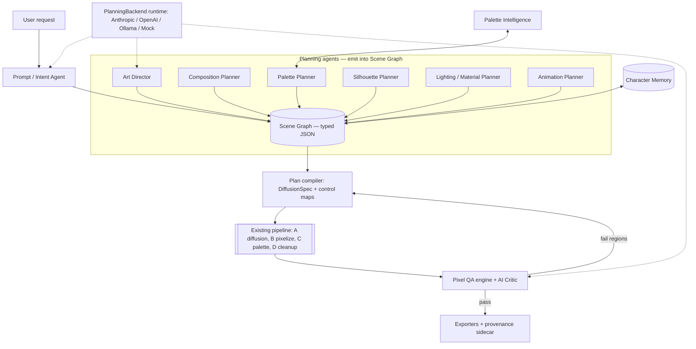

# Phase 0 Research — Agentic Pixel-Art Generation

Date: 2026-07-16 · Author: Agentic architecture review (Claude Code) · Status: **Draft for review**

This is the Phase 0 research deliverable requested for the "agentic pixel-art" direction. It
reviews two reference systems, the professional pixel-editor landscape, and the current
model/technique research, then synthesizes a concrete proposal for how PixelForge should evolve
from a *hybrid diffusion pipeline* into an *agent-directed pixel-art platform* — **without
copying** any reviewed implementation. It closes with a gap analysis and the list of Phase 1
ADRs to author next.

> **Milestone gate.** Per the project's own working rule ("Begin with a complete research report,
> followed by the system architecture, and only then start implementation … pause for review at
> every milestone"), this document is where we stop and review. No production code is changed in
> this deliverable.

---

## 0. Executive summary

PixelForge already has the thing most competitors lack: a **deterministic, unit-testable pixel
refinement pipeline** (grid snap → palette quantization → cleanup) behind a swappable
`GenerationBackend`. That is a durable asset and should not be discarded.

What it lacks is everything *above* Stage A: the request is turned into a diffusion prompt by
plain string concatenation (`generation/prompt_builder.py`), there is no structured
representation of *what is being drawn*, no memory of previously generated characters, no
automated quality gate, and no agent that can plan or critique.

The two reference systems bracket the design space:

- **Texel Studio** proves the *agentic painter* thesis — an LLM places pixels through a tool API
  onto a palette-indexed canvas, giving deterministic, artifact-free output and conversational
  refinement. Its weakness is **scalability**: LLM-per-pixel-op tool loops are slow and expensive,
  and its license is source-available with a no-competing-SaaS clause, so we can study it but not
  reuse its code.
- **Agent Sprite Forge** proves the *plan → generate → deterministic post-process → export* thesis
  with excellent reproducibility hygiene (`pipeline-meta.json`, `prompt-used.txt`, chroma-key
  isolation, engine-ready export). Its weakness is **identity drift** and reliance on a proprietary
  built-in image generator.

**Recommended synthesis:** keep PixelForge's deterministic execution substrate, and add a thin
**multi-agent planning-and-critique layer** on top that communicates through a typed **Scene
Graph** (structured JSON). Agents *plan and verify*; they do **not** hand-place every pixel via
the LLM. Diffusion + the existing deterministic stages *execute*. A backend-agnostic
`PlanningBackend` interface (Anthropic / OpenAI / local Ollama / deterministic mock) mirrors the
existing `GenerationBackend` philosophy, so the whole agent layer stays offline-testable in CI.
This captures Texel Studio's agency and Agent Sprite Forge's reproducibility while keeping
PixelForge's pixel-quality guarantees and its "everything runs on the mock backend" testability.

---

## 1. Scope & method

| Reviewed | How | Confidence |
|---|---|---|
| `EYamanS/texel-studio` | Fetched repo landing page + README (2026-07-16) | Grounded on README claims; internal code not line-audited |
| `0x0funky/agent-sprite-forge` | Fetched repo landing page + README (2026-07-16) | Grounded on README claims; internal code not line-audited |
| Aseprite / LibreSprite / Piskel | Prior domain knowledge + public docs | High |
| Diffusion / consistency papers | Web search (2024–2026) + prior knowledge | Mixed; citations in §4 and Sources |
| PixelForge current state | Direct read of this repo (`ARCHITECTURE.md`, `DECISIONS.md`, `backend/src/`) | High |

**Guardrails observed.** (1) No implementation is copied — only architectural concepts are
carried forward, and always re-expressed to fit PixelForge's existing interfaces. (2) Licensing
was checked: **Texel Studio is source-available with an explicit "don't host it as a competing
SaaS" restriction** — that is *not* MIT/Apache-compatible, so its code must not be vendored;
concepts only. Agent Sprite Forge is a "skill" bundle (SKILL.md + Python scripts) whose license
must be confirmed before any file-level reuse; we take concepts only. This reinforces the existing
D-008 (MIT) and D-001 (Apache/MIT-only weights) licensing posture.

---

## 2. Baseline — where PixelForge stands today

From `ARCHITECTURE.md` / `DECISIONS.md` and a direct read of `backend/src/pixelforge/`:

**Strengths already in place**
- Hybrid pipeline (D-002): `pipeline.py` runs diffusion (Stage A) → `pixelize` (B) →
  `apply_palette` (C) → `cleanup` (D). Stages B–D are pure and deterministic.
- Swappable model backends behind `GenerationBackend` (`flux.py`, `mock.py`, `registry.py`).
- Data-driven registries for modes/styles/palettes/exporters (D-005) — extend by adding data, not
  editing consumers.
- First-class deterministic `MockBackend` (D-004) → full CI without GPU/weights.
- Async in-process job queue with progress + cancellation (D-006).
- Palette system with extraction, quantization, dithering, import/export.
- Electron/React editor with immutable-snapshot undo/redo (D-007).

**Gaps relative to the agentic vision**
| Vision capability | Current reality |
|---|---|
| Multi-agent planning (Intent → Art Director → Palette/Silhouette/Lighting → QA) | None. `prompt_builder.py` is string concatenation of mode + style + user text. |
| Internal Scene Graph (structured, editable representation) | None. The request goes straight to a `DiffusionSpec`. |
| Persistent character memory (no identity drift) | None. Each generation is independent; `seed` is the only continuity. |
| Palette intelligence (rank/contrast/color-blindness/readability) | Partial: extraction + quantization exist; no analysis/scoring/CVD simulation. |
| Pixel QA engine (banding/jaggies/orphan/silhouette/palette-overflow detection + repair) | Partial: `remove_orphan_pixels`, `binarize_alpha` only. No detection or scoring. |
| AI critic / accept-reject-regenerate loop | None. |
| Backend-agnostic *planning* runtime (LLM/VLM) | None. Backends abstract *diffusion* only. |
| Plugin SDK for agents/tools | Registries exist for models/styles/exporters; no agent/tool plugin surface. |

The gap is almost entirely in the layer **above** the pipeline. That is good news: the proposal
below is largely *additive* and does not require rewriting Stages B–D.

---

## 3. Comparative analysis of reference systems

### 3.1 Texel Studio — the agentic painter

**Architecture.** LangGraph/LangChain agent loop, provider-agnostic LLM (Gemini / OpenAI /
Ollama). Redis Stack (`RedisSaver`) checkpointing gives resumable agent threads and multi-worker
scaling; `MemorySaver` for single-process. Python/FastAPI backend, Next.js frontend.

**Tool execution.** A structured toolkit the LLM calls: drawing (`draw_pixel`, `draw_line`,
`fill_rect`, `draw_circle`, `draw_ellipse`, `draw_triangle`, `draw_rotated_rect`), texture
(`noise_fill_rect`, `voronoi_fill`), inspection (`view_canvas` returns a pixel grid + color usage;
`get_pixel`). The agent *acts, then looks, then decides* — a perceive/act loop over a real canvas.

**Canvas representation.** Palette-indexed, not RGB — every pixel is an index into a user-defined
palette. This is the crux of its quality claim: no anti-aliasing, no half-pixels, no color
hallucination. Output is native size with optional upscale.

**Strategy.** Concept (a reference image via Gemini) → iterative tool-driven painting →
chat-driven refinement → export (native PNG / 512px upscale / 16-variant autotile with
edge-darkening).

**Refinement loop.** Chat continuation on the same thread ("make the top darker") re-enters the
agent with prior state intact — semantic edits without full regeneration.

| | Assessment |
|---|---|
| **Strengths** | True per-pixel control; deterministic tool calls; palette-locked output → no color hallucination; conversational editing; local/free via Ollama; transparent (you can see every action). |
| **Weaknesses** | LLM-in-the-loop *per drawing operation* is slow and token-expensive; quality of complex sprites is bounded by the LLM's spatial reasoning; concept phase hard-depends on Gemini; autotile edge-darkening needs manual calibration; requires Redis **Stack** (not vanilla Redis). |
| **Scalability** | Horizontal via Redis workers, but *cost per sprite* scales with op count — weak for 32×32+ detailed sprites or large batches. |
| **Limitations** | No diffusion path (can't leverage strong image priors for rich shading/texture); no formal QA scoring; identity/character memory not a first-class feature. |
| **License** | Source-available, **no competing-SaaS** clause → **concepts only**, no code reuse. |

**How PixelForge should do better.** Adopt the *palette-indexed canvas as ground truth* and the
*perceive/act tool loop*, but **do not** make the LLM place most pixels. Use the agent to **plan**
(silhouette, regions, materials, lighting) and to **critique/repair** (QA), and let diffusion +
deterministic executors fill pixels. Reserve LLM tool-painting for *small, surgical* edits
(icons, touch-ups), where its cost is acceptable and its control is unmatched. This keeps agency
where it adds value and avoids the per-pixel scalability wall.

### 3.2 Agent Sprite Forge — the plan-then-deterministic-pipeline

**Architecture.** A Codex/Grok "skill" bundle (100% Python). Flow: agent plans asset type /
layout / style / frame count → built-in image generation produces raw visuals → deterministic
Python post-processors → engine-ready export. Three skills: `$generate2dsprite`, `$generate2dmap`,
`$video2dsprite` (video-sampled dense motion cycles).

**Reusable concepts (concepts only — confirm license before any file reuse):**
1. **Deterministic post-processors** as the quality backbone (`generate2dsprite.py`,
   `extract_prop_pack.py`, `compose_layered_preview.py`): chroma-key removal + despill, frame
   extraction/alignment, prop slicing, GIF/PNG transparent export. This validates PixelForge's
   Stage B–D philosophy — *the agent plans, deterministic code guarantees the output*.
2. **Reproducibility metadata**: every output ships `pipeline-meta.json` (generation context) +
   `prompt-used.txt` (exact directive). PixelForge should emit an equivalent **provenance
   sidecar** per asset so any sprite can be re-derived and audited.
3. **Chroma-key isolation** for backgrounds — a pragmatic complement to our alpha binarization
   for the img2img path.
4. **Layered map export** (base + dressed reference + props → Godot TileMap with collision/zones)
   — a concrete target for our World Asset Generator milestone.
5. **Video-to-frames sampling** for dense animation — a future animation input we don't have.

| | Assessment |
|---|---|
| **Strengths** | Clean plan/generate/deterministic separation; strong reproducibility hygiene; engine-ready scene wiring; transparent-asset extraction. |
| **Weaknesses** | Identity drift on full sheets (README recommends `3x3 idle` over full sheets for large creatures); magenta chroma-key is fragile vs. magenta-containing art; hard dependency on a proprietary built-in generator; no palette engine, no CVD/readability QA, no character memory. |
| **Scalability** | Deterministic post-processing scales well; asset *consistency* across a set does not (drift). |

**How PixelForge should do better.** Keep the deterministic-post-process discipline (we already
have it) and **add** the provenance sidecar + layered-export target. Solve the identity-drift
weakness structurally with a **Scene Graph + Character Memory** (§6), rather than prompt tricks.

### 3.3 Professional pixel editors — why artists choose Aseprite / LibreSprite / Piskel

| Editor | Why professionals choose it | Lesson to carry forward |
|---|---|---|
| **Aseprite** | Purpose-built for pixel art: **indexed color mode** + tight palette editing; animation **timeline with tags**, layers, cels, onion skin; **tilemap/tileset** mode; pixel-perfect strokes, dithering brushes; **Lua scripting API**; per-frame + per-tag export. | Indexed-color as a first-class mode; tags-driven animation; a scripting/automation surface (our Plugin SDK); pixel-perfect tool math. |
| **LibreSprite** | Open-source (GPLv2) fork of the last GPL Aseprite — same UX, community-maintained. | Confirms the UX is the moat, not any one feature; and a licensing caution (GPL) — study UX, don't lift GPL code into an MIT project. |
| **Piskel** | Free, browser-based, near-zero onboarding; live sprite-sheet/GIF preview; simple layers + timeline. | Low-friction onboarding and live preview matter as much as depth; good model for PixelForge's in-app editor defaults. |

**Synthesis for our editor (already partly present in `frontend/features/editor/`):** the
existing pencil/fill/shape/select/layers/onion-skin/timeline set is the right foundation.
Modernize by making **indexed/palette-locked editing** first-class (mirrors Texel Studio's
canvas), adding **animation tags** and **tile/seamless mode**, and exposing a **scripting/plugin
surface** analogous to Aseprite's Lua API (our Plugin SDK milestone). The differentiator vs. all
three: the editor is **agent-aware** — the same Scene Graph the agents planned is what the artist
edits, and QA runs live in the canvas.

---

## 4. Research landscape — models & techniques

Grounding for which priors and adapters the agent layer should orchestrate. Foundational items are
from prior knowledge; 2024–2026 pixel-specific items are from the searches in Sources.

| Family | What it gives us | Pixel-art relevance | Fit for PixelForge |
|---|---|---|---|
| **Latent diffusion / Stable Diffusion** (Rombach et al.) | Text→image via denoising in VAE latent space; efficient. | Native output is soft/AA'd → *must* be snapped to grid (our Stage B). | Substrate assumption behind D-002. |
| **SDXL** | Stronger base, huge community LoRA/ControlNet ecosystem. | Many pixel-art LoRAs + mature ControlNet. | Optional/secondary backend (license: OpenRAIL++), per existing model-research. |
| **FLUX.1-schnell** | Apache-2.0, distilled 1–4 step. | Strong adherence; good with pixel LoRAs; CPU-viable. | **Primary** (D-001) — unchanged. |
| **Consistency / distillation** (Consistency Models; LCM; SDXL-Turbo) | Few/one-step sampling. | Fast iteration → makes agent-driven regenerate-failing-regions loops affordable. | Enables the QA "regenerate only failing regions" loop cheaply. |
| **ControlNet** (Zhang et al.) | Structural conditioning (edges/pose/depth). | Sketch→sprite; **silhouette/outline conditioning** from the Scene Graph. | Silhouette & pose agents emit control maps. |
| **LoRA** (Hu et al.) | Cheap style/subject adapters. | Pixel-art style; per-character identity adapters. | Style learning + character-identity LoRAs (memory). |
| **DreamBooth** (Ruiz et al.) | Subject-driven fine-tuning from few images. | Character identity locking. | Character memory (training path). |
| **IP-Adapter / InstantID** | Reference-image conditioning **at inference**, no training. | Character consistency from a reference frame with no per-character training. | **Preferred first step** for character memory — cheaper than per-character LoRA. |
| **CLIP / SigLIP** | Image/text embeddings. | Similarity scoring: prompt-alignment + identity-match + style-match metrics. | Powers the **AI critic** scores and dedup/readability checks. |
| **PixDiff-PIG** (2025) | *Palette-informed* diffusion; 42k-sprite set; FID 19.6 vs LDM 28.4; palette-consistency 0.82. | Directly targets palette-faithful sprites. | Candidate future in-house model direction; validates palette-conditioning. |
| **Sprite Sheet Diffusion** (2024) | Reference + pose→action sequences; consistency benchmark. | Cross-frame animation consistency. | Blueprint for the Animation agent's consistency metrics. |
| **PixelGen** (2026) | Pixel-space diffusion + perceptual loss beats latent for crisp targets. | Fixed pixel-space target = stable, crisp small sprites. | Watch-list for a future native pixel-space backend. |

**Takeaways for the agent layer.** (1) Consistency/distillation models make the *critique →
regenerate-failing-region* loop economically viable. (2) IP-Adapter-style reference conditioning
is the cheapest credible path to character memory before committing to per-character LoRA/DreamBooth.
(3) CLIP/SigLIP embeddings are the measurement backbone for the AI critic and for
identity/style/readability scoring. (4) Palette-informed diffusion (PixDiff-PIG) is external
validation of PixelForge's palette-first stance and a plausible future in-house model.

---

## 5. Reconciling the two philosophies

The prompt frames a dichotomy: *"generate then downscale"* (photographer) vs. *"paint like an
artist."* PixelForge does **not** have to choose:

- Diffusion + deterministic Stages B–D is the right **execution substrate** for rich, shaded
  sprites at 16–256px (strong priors, fast, testable).
- The **agent layer** supplies the artist's judgment the substrate lacks: *planning* (silhouette,
  composition, palette, lighting, materials) and *critique* (QA, readability, consistency).
- Texel Studio's **tool-painting** is retained as a **surgical mode** — small icons and targeted
  repairs where LLM per-pixel control is worth its cost.

So: **agents think like a pixel artist; the pipeline paints like one.** Every pixel gets "a reason
to exist" because it traces back to a Scene-Graph decision (region → material → light → palette
index), not because the LLM placed it by hand.

---

## 6. Proposed superior architecture (synthesis)

A thin planning/critique layer over the **existing** pipeline, communicating via a typed Scene
Graph, with a backend-agnostic planning runtime, character memory, palette intelligence, and a QA
engine. All new services are additive and mock-testable.

**Design commitments**

1. **Scene Graph is the contract.** A pydantic model (`core/scene_graph.py`) capturing entity,
   parts, materials, colors (as palette indices), lighting, pose, camera, palette id, animation
   state. Agents read/write it; the pipeline compiles from it; the editor edits it. This is what
   enables "edit without regeneration" and structurally defeats identity drift (Agent Sprite
   Forge's core weakness).
2. **Agents plan and critique — deterministic code executes.** Avoids Texel Studio's per-pixel
   LLM scalability wall. LLM tool-painting is a *surgical* mode, not the default path.
3. **`PlanningBackend` mirrors `GenerationBackend`.** One interface, multiple providers, plus a
   **deterministic `MockPlanningBackend`** so the entire agent layer runs in CI with no API keys —
   consistent with D-004. Agent I/O is structured JSON validated against the Scene Graph schema.
4. **Additive, registry-driven.** New agents/tools/critics register into new registries, matching
   D-005. Existing Stages B–D are untouched; `pipeline.py` gains a compiled-spec entry point.
5. **Provenance sidecar** per asset (Scene Graph + prompts + seeds + model versions), adopting
   Agent Sprite Forge's reproducibility hygiene.
6. **QA loop uses cheap regeneration.** Consistency/distilled sampling + region masks to
   regenerate only failing regions — affordable because of §4.

**Mapping to the repo**

| Proposed component | Where it plugs in |
|---|---|
| Scene Graph model | new `core/scene_graph.py` (pydantic, no `Any`) |
| Planning agents + runtime | new `agents/` package; `PlanningBackend` + registry mirroring `generation/backends/` |
| Plan compiler | extends `generation/prompt_builder.py` → `plan_compiler.py` producing `DiffusionSpec` + control maps |
| Palette Intelligence | extends `palettes/service.py` (ranking, contrast, CVD sim, readability, dedup, compression) |
| Pixel QA engine + critic | new `qa/` package; extends `pixelize/cleanup.py`; uses CLIP/SigLIP scores |
| Character Memory | new `memory/` package + `projects/store.py` persistence; IP-Adapter reference path first, LoRA later |
| Agent/tool plugin surface | extend the registry pattern; Plugin SDK milestone |

---

## 7. Gap analysis (have vs. need)

| Capability | Have | Need | Effort |
|---|---|---|---|
| Deterministic pixel pipeline | ✅ | keep | — |
| Swappable diffusion backends | ✅ | keep | — |
| Structured Scene Graph | ❌ | new pydantic model + compiler | M |
| Planning agents + runtime | ❌ | `agents/` + `PlanningBackend` + mock | L |
| Character memory (no drift) | ❌ | memory store + IP-Adapter path | L |
| Palette intelligence (rank/CVD/readability) | ◐ | extend palette service | M |
| Pixel QA + AI critic + repair loop | ◐ | `qa/` + CLIP/SigLIP scoring | L |
| Provenance sidecar | ❌ | serialize Scene Graph + params | S |
| Agent/tool Plugin SDK | ◐ | registry-based agent/tool plugins | M |
| Indexed-color / tags / seamless in editor | ◐ | editor depth (aligns with M5) | M |

(◐ = partial today.)

---

## 8. Risks & open questions

- **Latency/cost of the agent layer.** Multiple LLM calls per generation. Mitigation: cache plans,
  batch agent calls, make planning depth a setting, always offer a "fast path" that skips planning.
- **Offline-first tension (D-001/D-004).** Cloud LLM planners conflict with the local-only stance.
  Mitigation: local Ollama/VLM planner + `MockPlanningBackend` as first-class; cloud is opt-in.
- **Character memory approach.** IP-Adapter (inference-time, cheap) vs. per-character LoRA
  (training, stronger identity). Recommend IP-Adapter first; LoRA behind the training milestone.
- **QA metric validity.** CLIP/SigLIP scores need calibrated thresholds against a labeled sprite
  set to avoid false rejects. Needs a small golden dataset.
- **Scope.** This is a multi-milestone program; it must land incrementally behind flags without
  regressing the current pipeline or CI.
- **Licensing.** Texel Studio (no-compete source-available) and LibreSprite (GPLv2) are
  study-only. Any borrowed code would contaminate the MIT license — concepts only.

---

## 9. Proposed next steps (Phase 1) — pause for review

If this direction is approved, Phase 1 produces one ADR per subsystem **before** any
implementation:

1. **ADR — Scene Graph schema & lifecycle** (the central data contract).
2. **ADR — Agent runtime & `PlanningBackend` interface** (providers, mock, structured-JSON I/O, orchestration: LangGraph-style vs. in-house).
3. **ADR — Character Memory** (IP-Adapter-first vs. LoRA; storage; identity metrics).
4. **ADR — Palette Intelligence** (ranking, contrast, CVD simulation, readability, compression).
5. **ADR — Pixel QA engine & AI critic** (defect taxonomy, metrics, region-repair loop, thresholds/golden set).
6. **ADR — Agent/Tool Plugin SDK** (extending the registry pattern to agents and tools).
7. **Roadmap addendum** — sequence the above as milestones **M7+**, each landing behind a flag with
   mock-backed tests, never regressing the current pipeline.

**Recommended first implementation slice (after ADRs approved):** Scene Graph model +
`MockPlanningBackend` + a single Intent/Art-Director agent that compiles to today's `DiffusionSpec`
— end-to-end on the mock backend, fully tested, zero external dependencies. It proves the layer
without touching Stages B–D.

---

## Sources

Reference systems (fetched 2026-07-16):
- Texel Studio — https://github.com/EYamanS/texel-studio
- Agent Sprite Forge — https://github.com/0x0funky/agent-sprite-forge

Pixel-art & consistency research (search, 2024–2026):
- [PixDiff-PIG: Palette-Informed Diffusion for Pixel Art Generation](https://www.researchgate.net/publication/398825200_PixDiff-PIG_Palette-Informed_Diffusion_for_Pixel_Art_Generation)
- [Sprite Sheet Diffusion: Generate Game Character for Animation](https://arxiv.org/html/2412.03685v2)
- [PixelGen: Pixel Diffusion Beats Latent Diffusion with Perceptual Loss](https://arxiv.org/html/2602.02493v1)
- [ORACLE: Consistent Character Generation with LoRAs in Diffusion Models](https://arxiv.org/pdf/2406.02820)
- [Few-shot multi-token DreamBooth with LoRA for style-consistent character generation](https://arxiv.org/abs/2510.09475)

Foundational techniques (prior knowledge; canonical references): Latent Diffusion / Stable
Diffusion (Rombach et al. 2022), SDXL (Podell et al. 2023), FLUX.1 (Black Forest Labs 2024),
Consistency Models (Song et al. 2023) / LCM (Luo et al. 2023), ControlNet (Zhang et al. 2023),
LoRA (Hu et al. 2021), DreamBooth (Ruiz et al. 2022), IP-Adapter (Ye et al. 2023) / InstantID
(2024), CLIP (Radford et al. 2021), SigLIP (Zhai et al. 2023).

Professional editors: Aseprite (aseprite.org docs), LibreSprite (github.com/LibreSprite),
Piskel (piskelapp.com).
